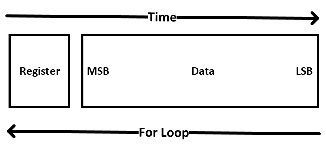

# Peripheral Hardware APIs
README for the APIs found within the boards module in the Base directory

# Table of Contents
* [Parent Class](#parent-class)
    * [SPI](#spi)
    * [Update](#update)
* [AD9959](#ad9959)
* [AD9854](#ad9854)
* [AD9910](#ad9910)
* [AD5372](#ad5372)

# Parent Class
The `PeripheralBoard` parent class is an API, containing the basic parameters and methods for serial communication with peripheral 
hardware. All boards have two pins for communication, a data/spi pin and a serial clock pin. 

## SPI
The SPI method is the basic communication method for all boards. It takes as parameters a time at which to finish 
writing the instructions, a set of bytes to send to the peripheral board, and the command register the instructional 
bytes are addressing (see board datasheets for examples). 

The method iterates through the individual bits of the command and register bytes, setting the SPI pin appropriately 
for each bit and pulsing the serial clock pin on and off. The data is written to the board with the register first, 
followed by the data most-significant-bit (MSB). The for loop iterates in reverse order, starting with the 
least-significant bit (LSB) at the final time and decrementing the time for each subsequent step. 

## Update
All boards have an update pin that triggers commands stored within the on-chip memory buffer to be executed. When a 
set of instructions is written via the `_spi` method, the instructions are stored in memory. Pulsing the update pin 
via this method executes all instructions stored in the memory buffer. This also guarantees deterministic timing.

# AD9959
Analog Devices AD9959 4 Channel DDS.

Frequencies and amplitudes are sent to the DDS in the form of tuning words, i.e., frequency tuning words (FTWs) and 
amplitude tuning words (ATWs). The FTW is a factor that scales the system clock rate (output of the refclock PLL loop),
and the ATW is a scale factor based on the full output. 

This DDS has the capability for on-chip two-level modulation and linear sweeping of frequency and amplitude using 
additional "profile pin" digital lines (the chip can also do linear phase sweeps, but that functionality is not currently 
supported by this API). In two-level modulation, two values are written to the chip. If the profile pin is set
to digital low the first value is output, and if the profile pin is set to digital high the second one is output.
In linear sweep mode, the start and end point of the sweeps and slopes are sent to the chip. Then, if the profile pin 
is set to logical high the DDS will linearly sweep to the end point using the provided trajectory, and if the profile pin
is set to logical low it will linearly sweep to the start point. 

## Initialize
The AD9959 requires a reference clock signal. We use an external reference clock signal (see paper for clock 
distribution scheme). The external signal is fed into a PLL with a programmable multiplier (value range 4 - 20)
to set the on-board system clock. This multiplier is set by the `initialize` method. There is also a VCO gain control 
bit that is set in this method according to the desired PLL output frequency. 

## Reset
Pulses on-chip reset pin, then initializes board.

## Arbitrary Output
Basic output function for the AD9959. Takes as parameters a start time, a channel or list of channels to output on, 
a list of output frequencies, a list of output powers (of equal length as the frequency list), and a total time over which 
to output. There is also an option to not pulse the update pin after writing (allows for multiple sets of instructions 
to be executed at once). 

The total time needs to be positive and long enough to write at least one frequency tuning word and one amplitude
tuning word. If not, it will print a warning and overwrite the total time to be the minimum time.If there are multiple 
steps, the time between steps (total time/number of steps) needs to be long enough for each set of ATWs and FTWs to get
written. If not, it will throw an exception. 

The method iterates through the elements of `freq_list` and `power_list` in equal intervals over time total time `tt`.
It converts the frequencies and powers into frequency tuning words and amplitude tuning words respectively and writes
the words to the appropriate command registers.

## Modulation
### Amplitude Modulation
This method is for two-level near-instantaneous modulation between two amplitudes. When the profile pin is at digital 
low the DDS outputs amplitude a0, and when the pin is set to digital high it outputs a1.

The method takes as parameters the time to enable modulation, the output channel(s) to be modulated, and the two 
amplitudes `a0` and `a1`. 

After writing to the channel select register, the method checks to make sure that `a0` and `a1` are different, otherwise
it disables modulation. If they are different, amplitude modulation is enabled in control register 0x03 and the two 
amplitude tuning words are written to the appropriate registers. 

### Frequency Modulation
This method linearly sweeps between two frequencies `f0` and `f1` over an amount of time `ramp_time`. The change is not
truly linear, but happens in `ramp_step` discrete steps. 

Working backwards in time (similar to `_spi` method of the parent class), this method first checks that `f0` and `f1` 
are different (if not disables modulation) and writes the two frequency tuning words
to the appropriate registers. Calculates what each step within the ramp should be based on the frequency difference
and ramp time, and writes this `delta_word` and the number of ramp steps to the appropriate places. Finally sends the 
appropriate commands to enable and set up the linear sweep mode. 

# AD9854
Analog Devices AD9854 CMOS 300 MSPS Quadrature Complete DDS

Similar to AD9959, frequencies and amplitudes are written to the device in the form of tuning words. This single channel
DDS has a standard output mode and chirp functionality to support wide-bandwith frequency sweeps. In chirp mode, 
the DDS is passed a start frequency, the size of each frequency step, and the rate at which frequency steps should occur
for a frequency sweep. This API only supports linear sweeps, but other patterns are possible. 

## initialize 
Same as AD9959, initialize sets the PLL loop multiplier for the on-board system locked to the externally applied
reference clock. The method also sets the DDS up for single tone mode and enables the amplitude multiplier. 

## chirp_initialize
Alternative to the `initialize` method, this sets the DDS up for chirp mode rather than single tone. It sets the PLL
loop multiplier as in `initialize` and enables chirp mode. It also writes the initial frequency tuning word passed during
instantiation. The rate of change for each frequency step is written as the `ramp_rate_clk`. Finally, it clears the 
delta frequency word by writing zeros to the register. 

## reset
Pulses the on-chip reset pin and initializes the board for single-tone mode. 

## arbitrary_output
Output method for both single tone mode and chirp mode. Takes as parameters a start time `dds_time`, a boolean flag
for chirp mode `chirp`, the total time over which to ramp the frequency `total_time`, the list of frequencies to 
output `freq_list` and the corresponding list of powers for each frequency step `power_list`.

Both single tone mode and chirp mode iterate through each frequency step, calculates the amplitude tuning word
if the amplitude changes and writes it to the register. In single tone mode, the method outputs each frequency 
and amplitude at a constant rate set by the total time and number of steps, writing to the FTW register. 
In chirp mode, the method calculates the slope between frequencies and writes the delta frequency word for each step.

# AD9910 
Analog Devices AD9910 Direct Digital Synthesizer. 

14 bit, 1 GSPS DDS. The AD9910 has four modes of operation: single tone, RAM modulation, digital ramp modulation, and 
parallel data port modulation. This API supports two modes: single tone and digital ramp modulation.  These modes 
provide the frequency, amplitude, and phase of the output signal. 

## initialize 
Sets the reference clock multiplier and on-chip VCO range for the clock PLL loop. 

## reset
Pulses on-chip reset pin. 

## single_tone
Enables single tone output. Writes a single output frequency to the evaluation board.

## Digital Ramp Modulation

### drg_enable
Enables frequency modulation using the on-chip digital ramp.

### set_ramp
Sets the parameters for frequency modulation. Takes the maximum and minimum frequency, as well as the size
and time duration of each step between the limits. Defines both a positive step size and a negative step size.  

### drg_high
Sets the DR control pin high, initiating positive slope sweep.

### drg_low
Sets the DR control pin low, initiating negative slope sweep. 
           

# AD5372
32 Channel, 16 bit DAC. Maximum output voltage range 20V. Useful as additional analog source on top of the PCI-6733
hardware native to the DeMarco Lab control hardware. 

## _spi_sync
Writes the information in bytes_to_write to the selected command register. Same as the Parent class_spi method, but 
sets sync_pin low before writing.

## _volts_to_code
Converts output voltage into DAC_CODE (see AD5372 datasheet).

## load
Loads a voltage to the DAC to output in the future on the selected channel.  

## set
Loads and immediately outputs a voltage on the DAC on the selected channel.
